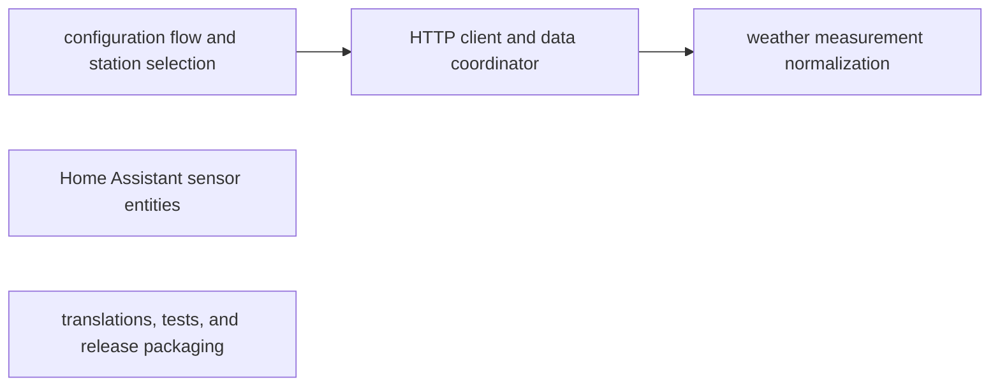

# Container diagram

```mermaid
flowchart LR
    Component1["configuration flow and station selection"]
    Component2["HTTP client and data coordinator"]
    Component3["weather measurement normalization"]
    Component4["Home Assistant sensor entities"]
    Component5["translations, tests, and release packaging"]
    Component1 --> Component2
    Component2 --> Component3
```
